# MP3 Music Player preview

## Technology used
- python `3.10`
- kivy with kivymd

## Video

## Screenshots
- Directories Tab
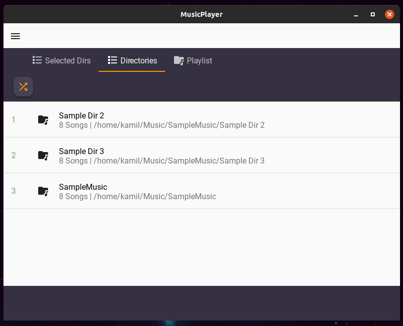

- Directories Tab - selecting directories for mixed playlist
    
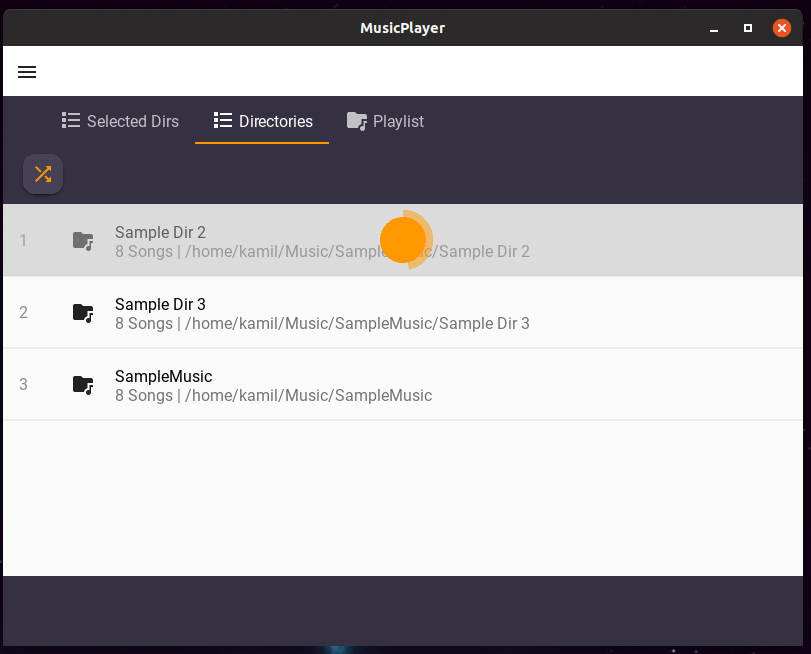

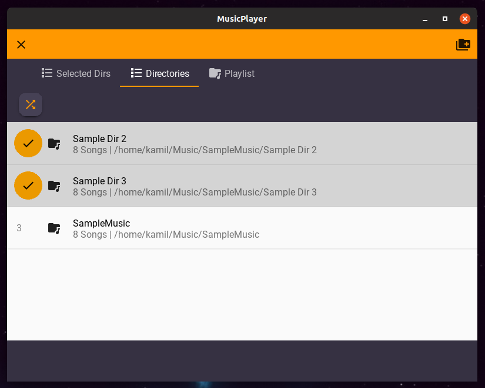

- Playlist Tab with songs from single directory
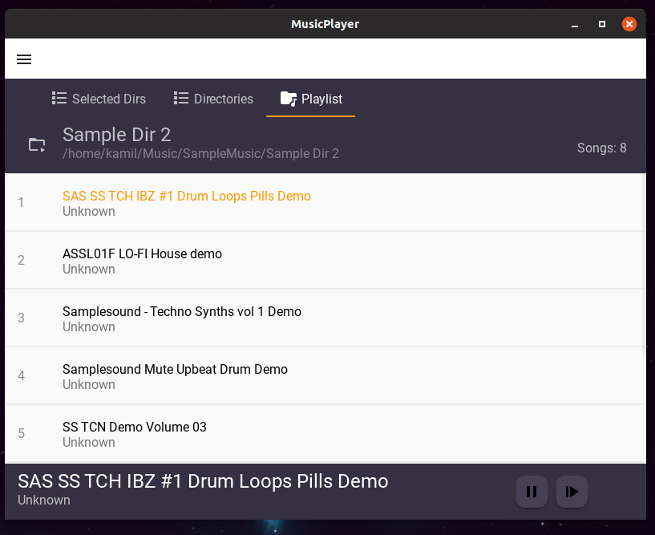

- Music Player Card
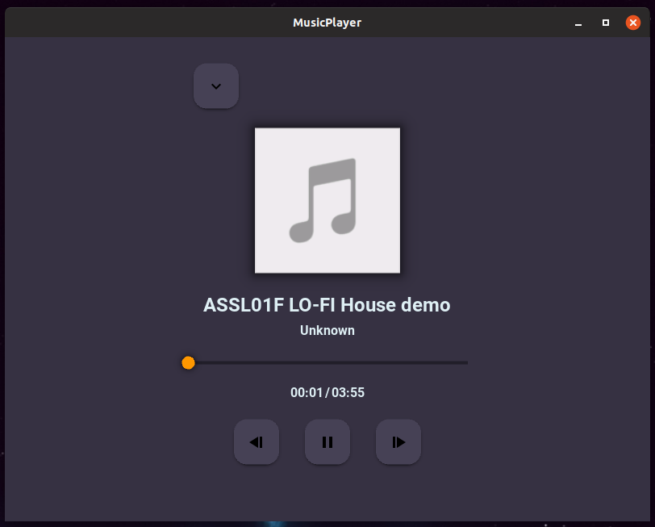

- Music Player Card - with song thumbnail
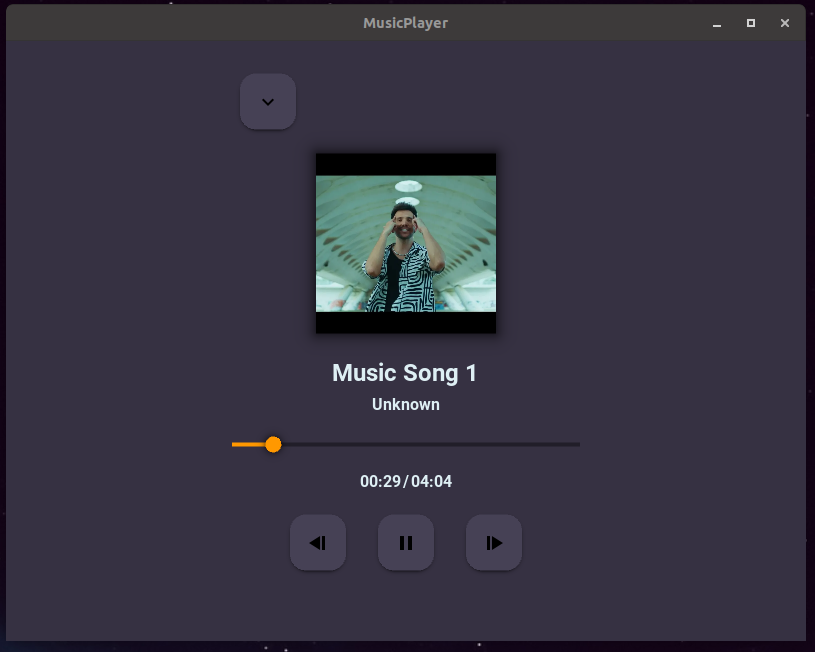

- Selected Directories Tab

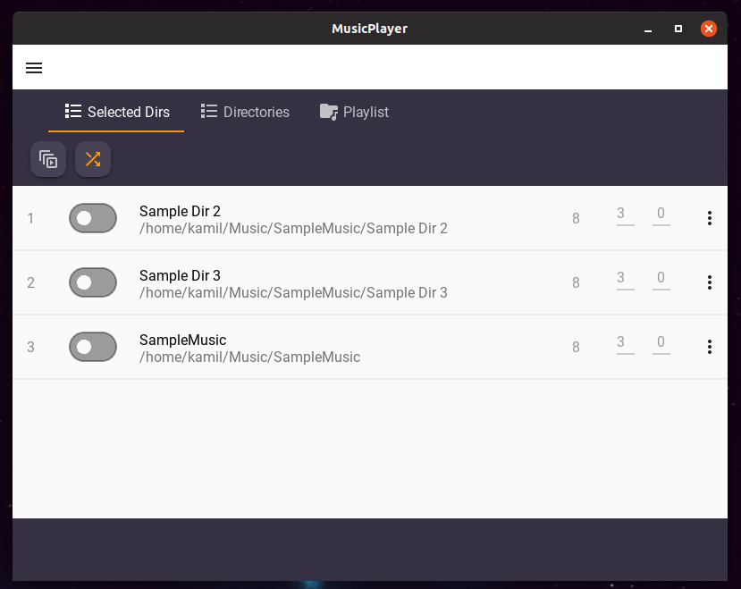
    - **Columns**
        - `1st column` - number of songs in directory
        - `2nd column` - number of songs that gonna be placed in a row in mixed playlist form specific directory
        - `3rd column` - order of directory items in mixed playlist (zero configured as higher position)

- Selected Directories Tab - with enabled directories

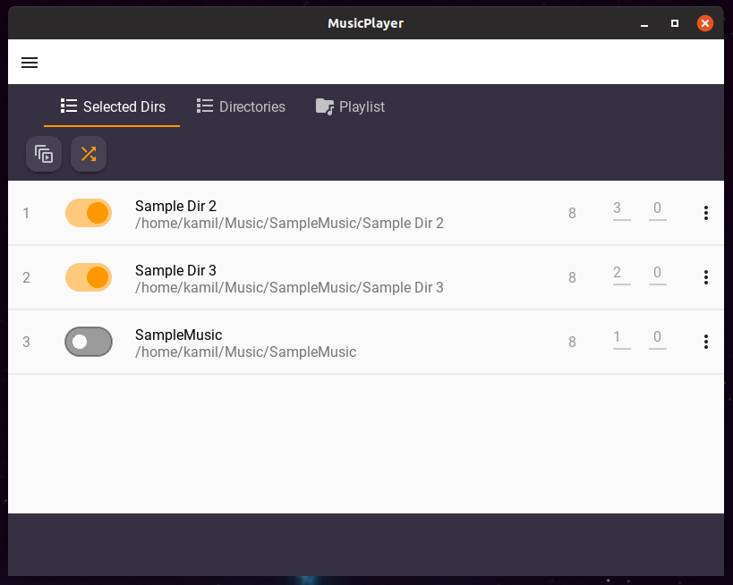

- Selected Directories Tab - list item menu

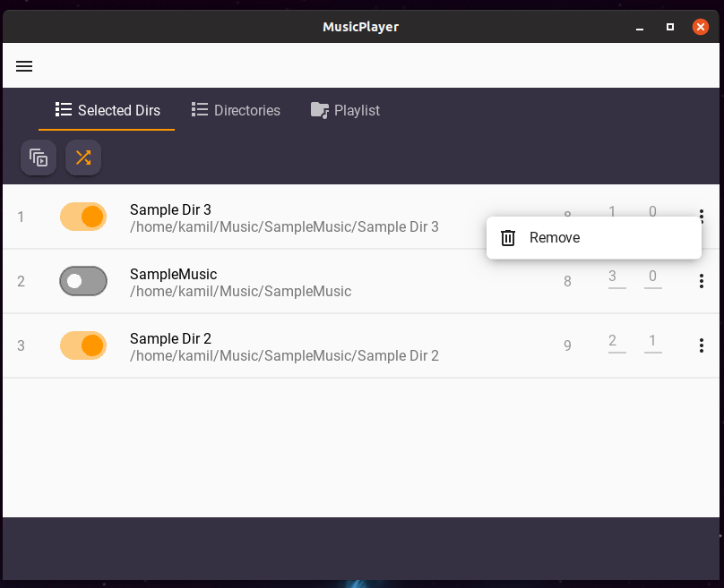

- Selected Directories Tab - item remove dialog confirmation

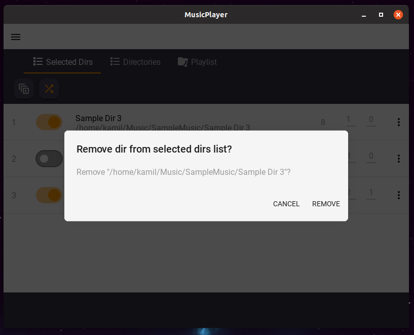

- Playlist Tab - Randomized and mixed playlist with songs from selected directories

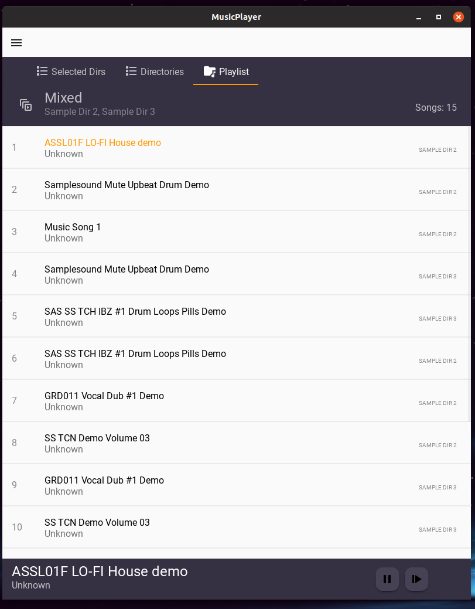
<!-- 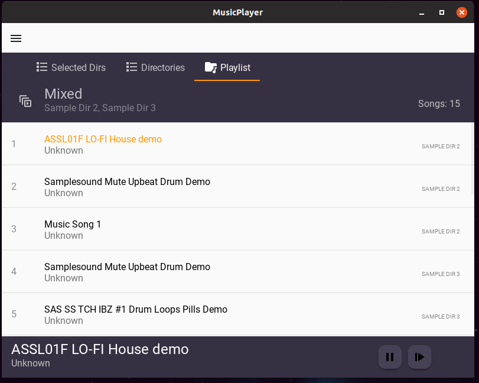 -->

- Menu

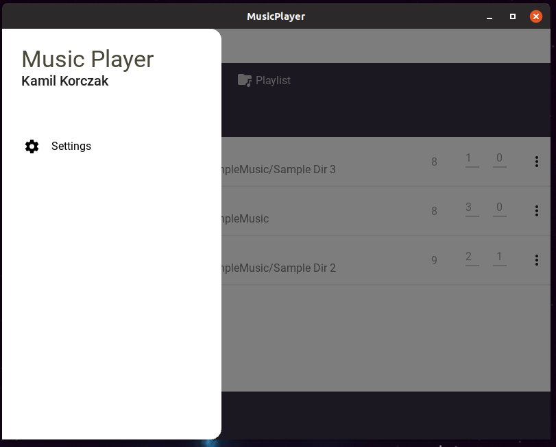

- Settings

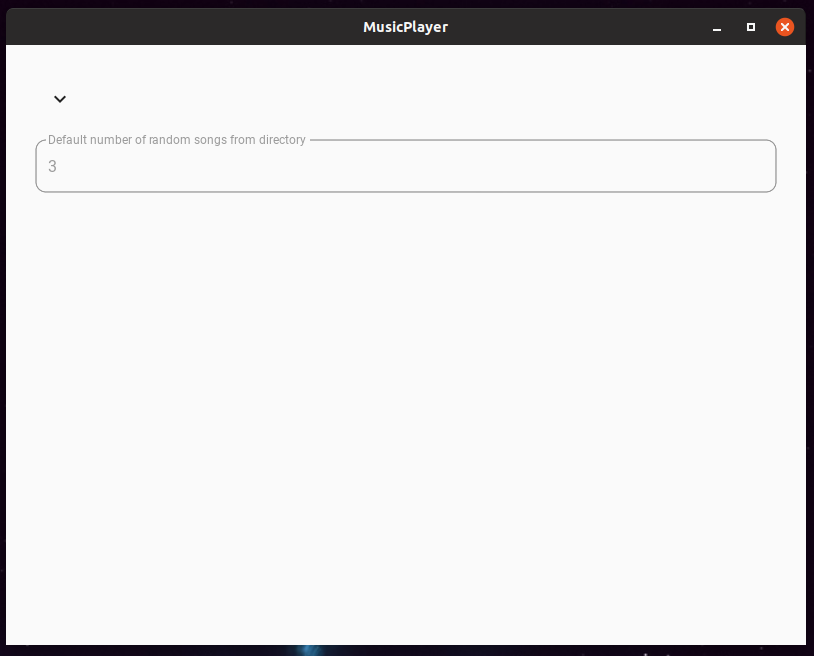
- Default number of songs that gonna be placed in a row in mixed playlist from one directory